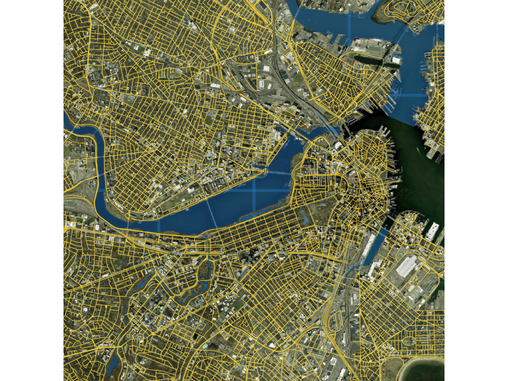
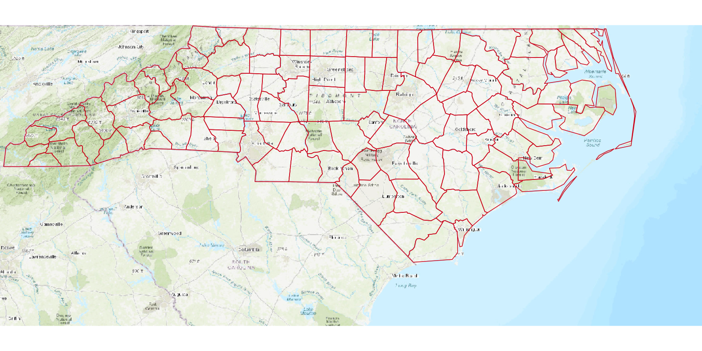

# arcgistiles

Map images, tiles, and basemaps from ArcGIS services.

`arcgistiles` reads map services and vector tile services, downloads the tiles
covering an area of interest, exports rendered map images one at a time or as a
series, and assembles the result into georeferenced rasters you can plot under
your own vector data.

## Installation

``` r
# install.packages("pak")
pak::pak("JosiahParry/arcgistiles")
```

## Reading a service

``` r
library(arcgistiles)

ms <- map_server(world_imagery_url())
ms
#> <arcgistiles::MapServer> "Layers"
#> <https://services.arcgisonline.com/ArcGIS/rest/services/World_Imagery/MapServer>
#> CRS: EPSG:3857
#> Capabilities: "Map", "Query", "Data", and "Tilemap"
#> Levels: 0-23 at 256x256 JPEG
#> Layers: 19
```

The tiling scheme comes back as a table of levels of detail, with the span of a
tile in map units at each level.

``` r
head(lods(ms), 4)
#>   level resolution     scale tile_width tile_height
#> 1     0  156543.03 591657528   40075017    40075017
#> 2     1   78271.52 295828764   20037508    20037508
#> 3     2   39135.76 147914382   10018754    10018754
#> 4     3   19567.88  73957191    5009377     5009377
```

## Tiles for an extent

`tile_grid()` is pure arithmetic on the tiling scheme, so you can see which
tiles an extent needs before fetching anything. A bounding box in any CRS is
reprojected into the service's own.

``` r
bbox <- wk::rct(-71.2, 42.3, -71.0, 42.4, crs = 4326)

tile_grid(ms, bbox, 12L)[1:3, ]
#>   level  row  col     xmin    ymin     xmax    ymax
#> 1    12 1514 1237 -7934775 5214840 -7924991 5224624
#> 2    12 1514 1238 -7924991 5214840 -7915207 5224624
#> 3    12 1514 1239 -7915207 5214840 -7905423 5224624
```

`get_tiles()` downloads them in parallel and `as_rast()` merges them into a
single georeferenced `SpatRaster`. Leave `level` out and it picks the one that
renders `bbox` closest to `size` pixels.

``` r
tiles <- get_tiles(ms, bbox, size = c(1024, 1024))
basemap <- as_rast(tiles)

terra::plotRGB(basemap)
plot(sf::st_geometry(my_data), add = TRUE)
```

Tiles missing from a cache are reported in the `ok` column rather than raising
an error, and `tilemap()` asks a service which tiles it actually holds before
you download.

## Map images

`export_map()` renders an extent of a dynamic map service. The server expands
the requested extent to the aspect ratio of `size`, so the returned object
carries the extent that was really drawn, which is what `as_rast()` needs to
place the image correctly.

``` r
census <- map_server(census_url())

img <- export_map(
  census,
  c(-104, 35.6, -94.32, 41),
  size = c(600, 400),
  layers = 3,
  layer_defs = list(`3` = "POP2000 > 1000000")
)

img
#> <MapImage> 600x400 png
#> CRS: EPSG:4269
#> Extent: -104, 35.0733333333333, -94.32, and 41.5266666666667
```

## Map series

`map_grid()` splits an extent into pages and `map_series()` exports them in
parallel, the equivalent of ArcGIS Pro's map series or data driven pages. Pages
can equally come from an `sf` object, one image per feature.

``` r
pages <- map_grid(c(-104, 35.6, -94.32, 41), nrow = 2, ncol = 3, overlap = 0.05)

map_series(census, pages, size = c(800, 600), dir = "atlas")
#>   page     name   ok       xmin ymax   scale
#> 1    1 page-001 TRUE -104.18665 41.0 3786608
#> 2    2 page-002 TRUE -100.96000 41.0 3786608
#> 3    3 page-003 TRUE  -97.73333 41.0 3786608
#> ...
```

Every page comes back at the same scale, which is the point of a series.

## Vector tiles and basemaps

``` r
vts <- vector_tile_server(open_street_map_url())

vector_tile_style(vts)          # Mapbox GL style, with absolute resource URLs
vector_tile_fonts(vts)          # font stacks the service publishes
vector_tile_sprite(vts)         # sprite sheet and index
```

Downloaded `.pbf` tiles decode straight into `sf`, one data frame per layer,
bound across tiles:

``` r
tiles <- get_vector_tiles(vts, bbox, level = 14L)

vector_tile_layers(tiles)
#> [1] "administrative boundary" "amenity area" "amenity point" ...

parts <- read_vector_tiles(tiles, layers = c("road", "water area"), crs = 3857)
parts$road
#> Simple feature collection with 62 features and 3 fields
#> Geometry type: MULTILINESTRING
#> Projected CRS: WGS 84 / Pseudo-Mercator
```

Roads and water from OpenStreetMap vector tiles over World Imagery, from
`09-vector-tile-sf.R`:



The basemap styles service is browsable without a token:

``` r
basemap_styles("arcgis")[1:3, c("path", "name", "group")]
#>                      path                    name     group
#> 1          arcgis/imagery          ArcGIS Imagery satellite
#> 2 arcgis/imagery/standard ArcGIS Imagery Standard satellite
#> 3   arcgis/imagery/labels   ArcGIS Imagery Labels satellite
```

Fetching a style itself needs a token with the `premium:user:basemaps`
privilege.

``` r
style <- basemap_style("arcgis/navigation", language = "es")
```

## Tile packages

Services that allow it can package their cache for offline use. The export runs
as an asynchronous job.

``` r
job <- export_tiles_job(vts, service_bbox(vts), levels = 0:3)
job_await(job)
write_tile_package(job, "world.vtpk")
```

`export_tiles()` does all three in one call, and
`estimate_export_tiles_size()` reports the download size first.

## Examples

`inst/examples/` holds a runnable script for each part of the package, with the
console output of a real run captured alongside it. See
[inst/examples/README.md](inst/examples/README.md).

Plotting vector data over downloaded tiles, from `08-plot-basemap.R`:


